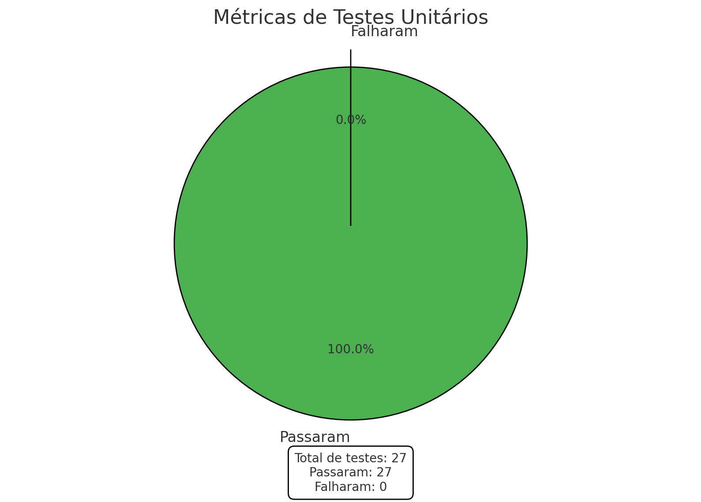
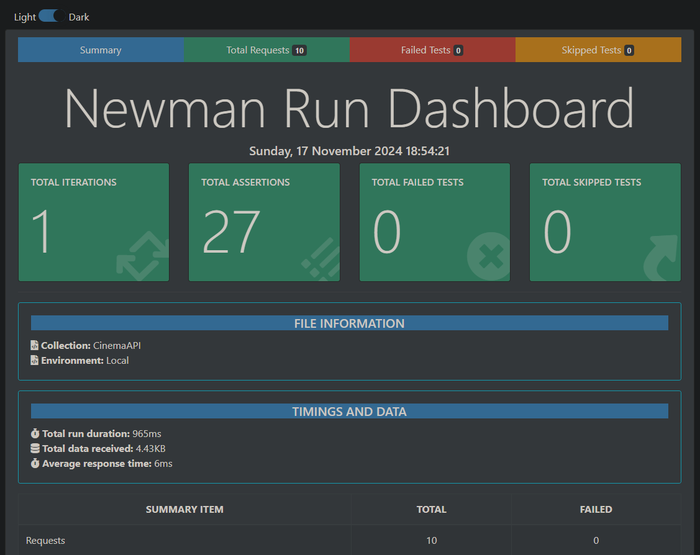
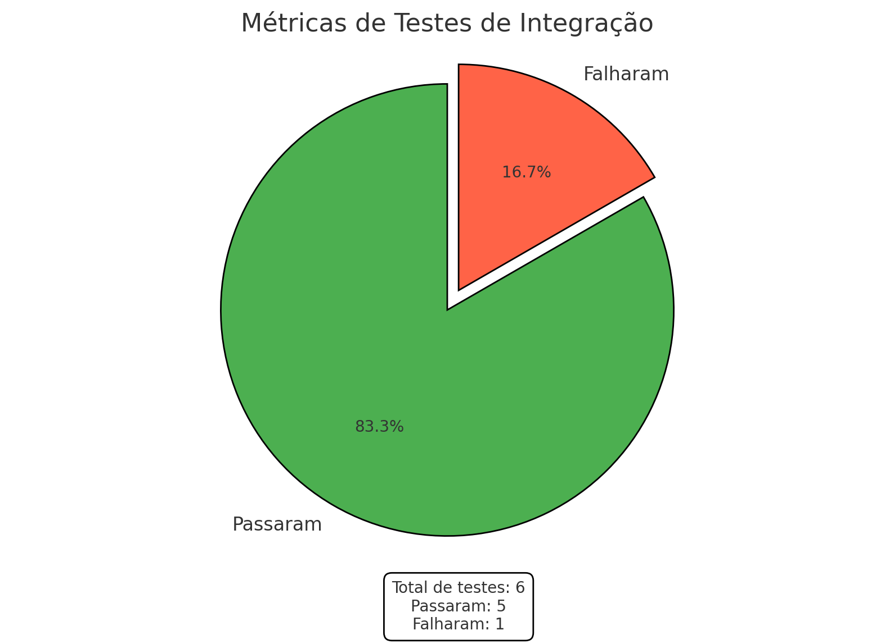
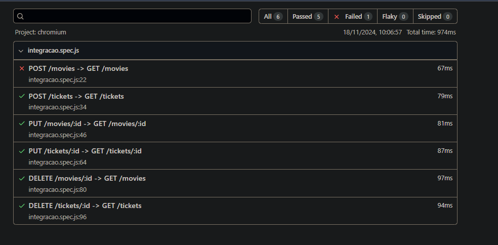
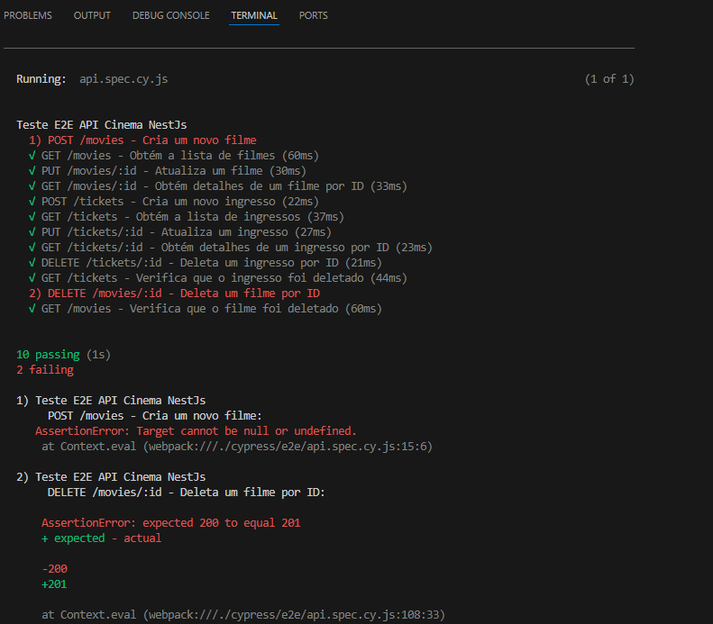

# Metricas e Resultados

## Testes Unitários
- 100% de cobertura de rotas
- 27 Testes
- 27 Passaram
- 0 Falharam

## Testes de Integração
- 100% de integração entre rotas
- 6 Testes
- 5 Passaram
- 1 Falhou

### Teste Falho - POST /Movies
Devido à rota não retornar uma mensagem de sucesso do filme cadastrado não foi possivel ter acesso ao id do filme e fazer a integração entre rotas
## Testes End to End
- 100% de cobertura de rotas com um fluxo end to end
- 12 Testes
- 10 Passaram
- 2 Falharam

### Teste Falho - POST /Movies
Devido à rota não retornar uma mensagem de sucesso ao cadastrar filme não foi possivel ter acesso ao id do filme e fazer a integração entre rotas
### Teste Falho - DELETE /Movies/:id
Quando um filme é deletado com sucesso retorna um status code 200, porém o correto é 201 de acordo com a documentação.

