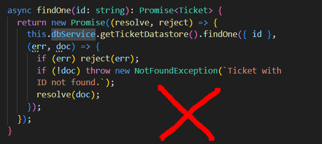
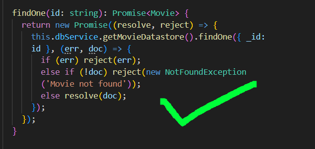
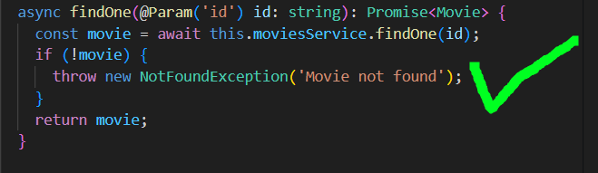

# Melhorias

## Melhorias Feitas
### ``ticket.service.ts``
Ao executar a API, fazendo chamada para o endpoint ``/tickets``, em qualquer rota que exigia o ID, constava-se uma falha no sistema, onde a requisição não retornava a resposta adequada e crashava, ao analisar o codigo foram encontrados defeitos no arquivo ``tickets.service.ts ``, nos metodos ``findOne()``, ``update()`` e ``remove()``, onde ao comparar com os metodos do arquivo ``movies.service.ts``, foi possivel identificar que os metodos de tickets não fazem uma chamada adequada do ID e também o uso incorreto das condicionais dentro dos metodos.

### ``ticket.controller.ts``
Após a correção no arquivo ``ticket.service.ts``, foi possivel fazer chamadas com os ``ID's`` corretos, porém ao fazer requisição à um ``ID`` que não existia o sistema falhava, não retornando a resposta adequada e crashando A API. 

Ao analisar o arquivo ``ticket.controller.ts``, foi possivel identificar que os metodo ``remove()``, ``update()`` e ``findOne()`` não possuem tratamento de erro, o que pode causar falhas no sistema. Para corrigir isso, é necessário adicionar um tratamento de erro para lidar com situações em que o ``ID`` não é encontrado ou ocorre algum outro erro durante a execução da operação.

## Melhorias Sugeridas
